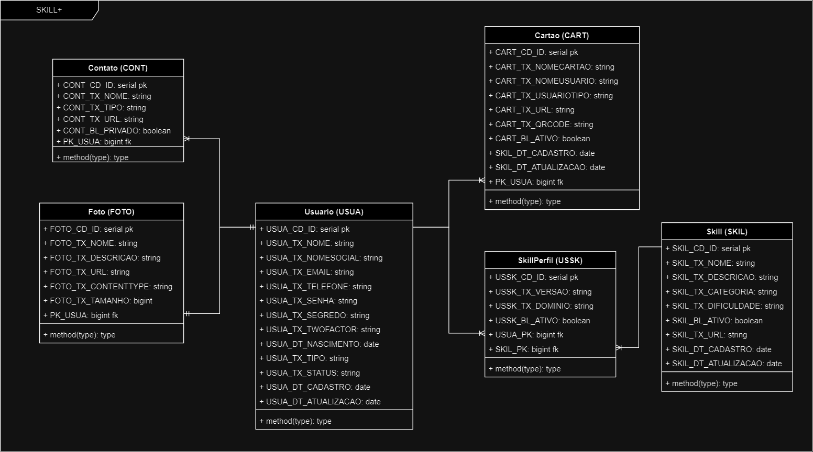

# SkillPlus

## Descrição

SkillPlus é um projeto Spring em Java 21 para compartilhamento de habilidades e contatos. Ele conta com sistemas de autenticação utilizando Spring Security e JWT.

## Tecnologias Utilizadas

- Spring Boot
- JWT
- OpenAPI
- Flyway
- Postgres
- java-totp

## Recursos

- **CRUD completo**: O SkillPlus possui um sistema CRUD completo para usuários, contatos, habilidades e cartões.
- **Banco de dados**: Utilizando o Flyway para controle de versão do banco de dados.
- **Tratamento de Exceções**: O projeto conta com tratamento de erros com ErrorResponse e exceções personalizadas.
- **Paginação**: Implementação de paginação para melhorar a performance e a usabilidade.
- **Upload de fotos**: Os usuários podem fazer upload de suas fotos.
- **Documentação**: A documentação do projeto é robusta e foi feita utilizando OpenAPI.

## Modelo Banco de Dados

 

## Documentação da API

A documentação da API pode ser acessada em `localhost:8080/swagger-ui.html`

 

## Em Desenvolvimento

- **Autenticação 2FA**: Desenvolvendo um sistema de geração de TOTP para autenticação 2FA e mobile. Acreditamos que a autenticação 2FA aumentará a segurança dos usuários ao acessar suas contas.
- **Websockets**: Estudando o uso de websockets para mensagens em tempo real e envio de autenticação de aplicativo mobile para web. Isso permitirá uma comunicação mais rápida e eficiente entre os usuários.

## Contribuição

Contribuições são sempre bem-vindas. Sinta-se à vontade para abrir uma issue ou enviar um pull request.

## Licença

Este projeto está licenciado sob a licença MIT.